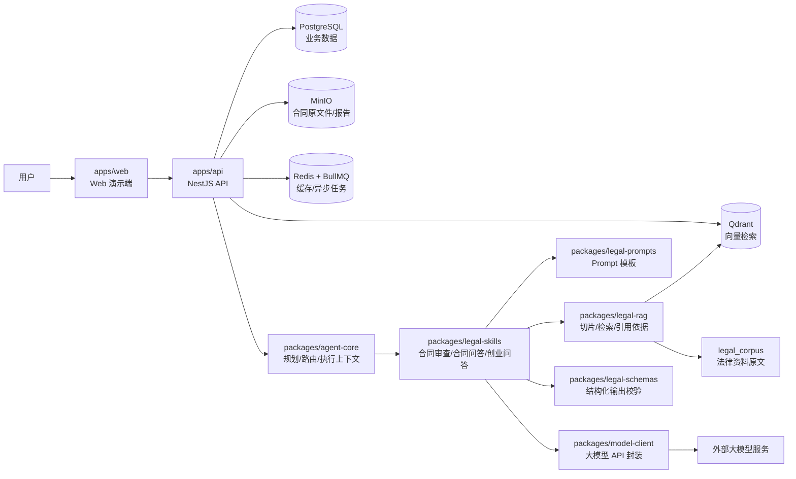
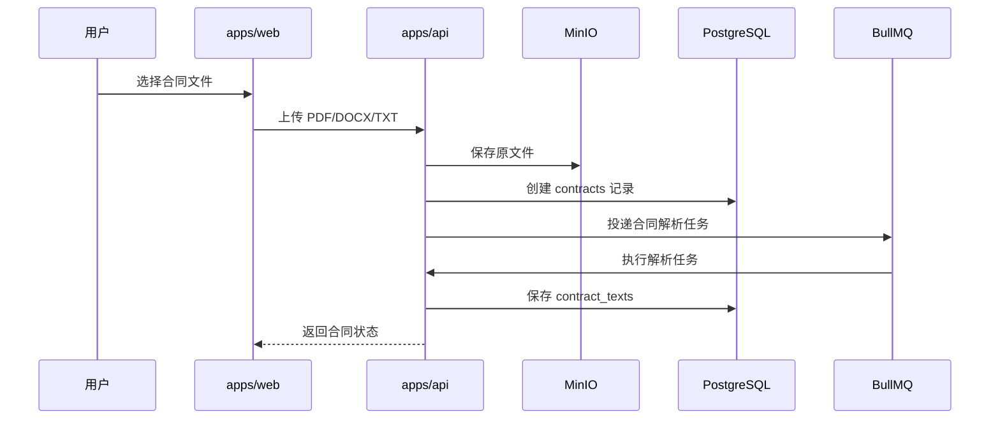
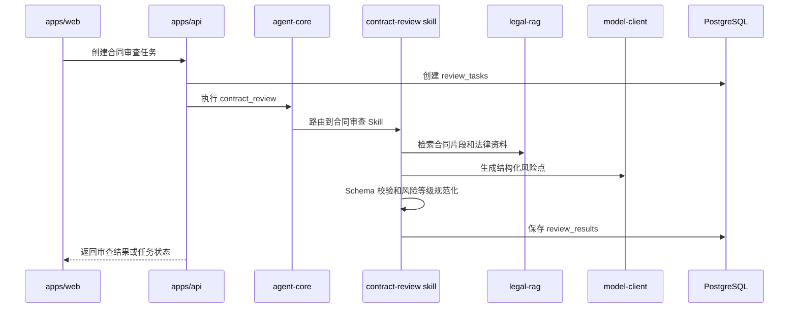
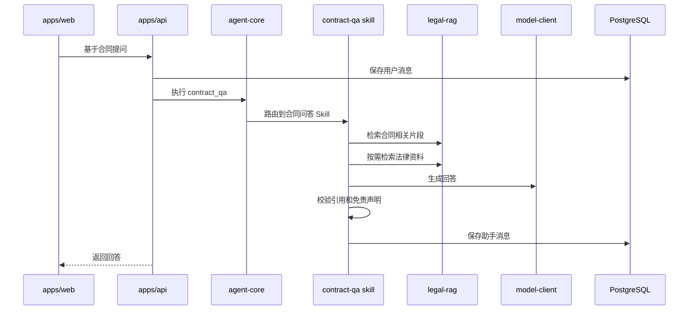
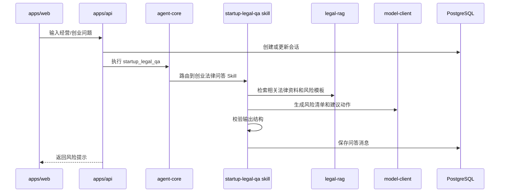
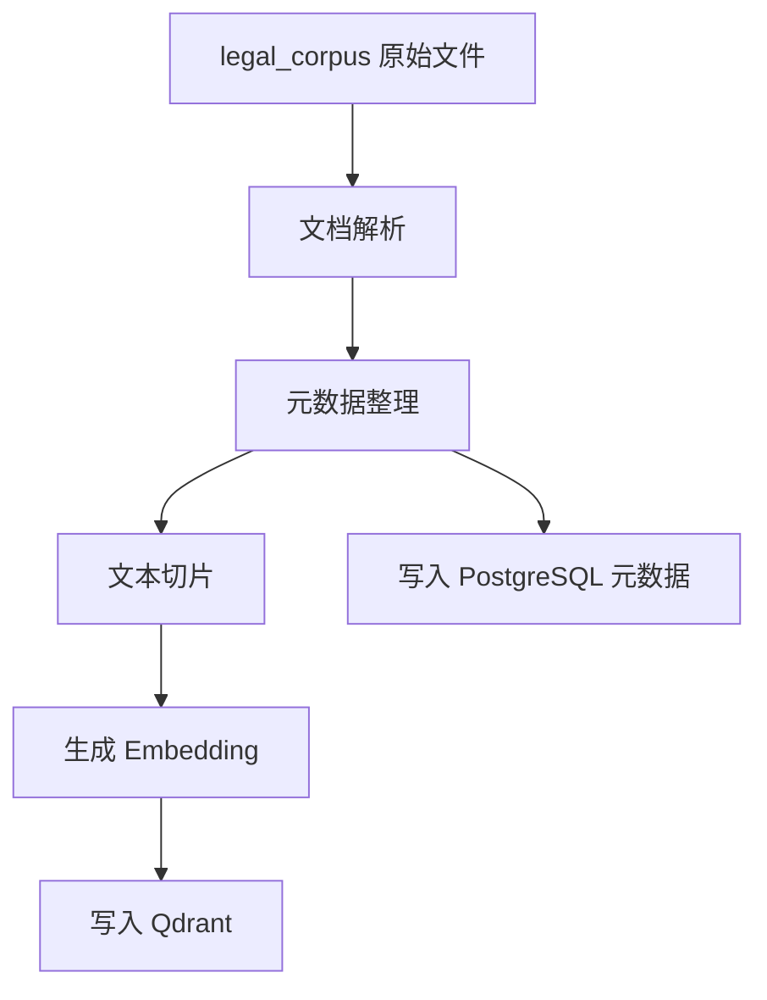

# 法律小助手总体架构设计

## 1. 文档目的

本文档用于说明“法律小助手”第一版 MVP 的总体工程架构。

它回答以下问题：

- 项目整体采用什么技术栈和工程结构。
- 前端、后端、Agent、RAG、数据库、对象存储、任务队列、向量库之间如何协作。
- 每个核心模块负责什么，不负责什么。
- 合同上传、合同审查、合同问答、创业法律问答的核心数据流是什么。
- 第一版明确不做哪些能力，避免范围失控。

本文档是后续初始化 `apps/`、`packages/`、`infra/` 目录和编写代码的依据。

## 2. 架构目标

第一版架构目标是：用可学习、可扩展、可验证的方式，跑通法律 AI 助手的核心闭环。

核心闭环包括：

1. 用户上传合同。
2. 系统保存原文件并解析正文。
3. Agent 判断任务类型并选择法律技能。
4. RAG 检索合同片段、法律资料和审查规则。
5. 大模型生成结构化风险点或问答结果。
6. 系统校验输出、保存记录并返回用户。

架构设计优先级：

- 先清晰，再复杂。
- 先模块化单体，再考虑微服务。
- 先自研轻量 Agent Core 学习核心机制，再考虑引入 LangGraph、CrewAI、AutoGen 等重型框架。
- 先支持可复制文本 PDF、DOCX、TXT，再考虑 OCR。
- 先完成小型可控法律知识库，再考虑全量法规库。

## 3. 技术栈决策

第一版采用以下技术方向：

```text
前端：React + TypeScript
小程序扩展：后续可用 Taro + React
后端：NestJS + TypeScript
数据库：PostgreSQL
ORM：Prisma
对象存储：MinIO
缓存与任务队列：Redis + BullMQ
向量数据库：Qdrant
AI 能力：大模型 API + 自研轻量 Agent Core + RAG
部署：Docker Compose
```

说明：

- 第一版建议先做 Web 演示端，不直接做小程序端。
- 后端采用 NestJS 模块化单体，先降低学习和部署成本。
- Agent 不直接采用 CrewAI、AutoGen 或 LangChain Agent 全家桶，而是先实现轻量自研 Agent Core。
- RAG 第一版先做向量检索 + 元数据过滤，后续再补 BM25、RRF、多查询、多跳检索。

## 4. 总体架构图



## 5. 推荐目录结构

```text
法律小助手/
├─ apps/
│  ├─ api/                         # NestJS 后端服务
│  └─ web/                         # 第一版 Web 演示端
├─ packages/
│  ├─ agent-core/                  # 轻量 Agent 核心
│  ├─ legal-skills/                # 法律业务技能
│  ├─ legal-rag/                   # 法律知识库与合同片段检索
│  ├─ legal-prompts/               # Prompt 模板
│  ├─ legal-schemas/               # 结构化 Schema
│  ├─ model-client/                # 大模型调用封装
│  └─ shared/                      # 通用类型、错误码、工具函数
├─ legal_corpus/                   # 法律资料原文
├─ docs/
│  ├─ mvp-spec.md
│  ├─ agent-project-plan.md
│  ├─ reference-projects.md
│  ├─ architecture.md
│  ├─ agent-flow.md                # 待补充
│  └─ acceptance.md                # 待补充
├─ infra/
│  ├─ docker-compose.yml
│  └─ env.example
├─ tests/
└─ tasks.md
```

## 6. 模块职责

### 6.1 `apps/web`

职责：

- 提供第一版 Web 演示界面。
- 支持合同上传、审查结果展示、合同问答、创业法律问答。
- 展示任务状态、风险列表、引用片段、免责声明和律师咨询提示。

不负责：

- 不直接调用大模型。
- 不直接访问数据库、对象存储、向量库。
- 不在前端实现法律判断逻辑。

第一版页面建议：

- 合同上传页。
- 合同审查结果页。
- 合同问答页。
- 创业法律问答页。
- 简单任务状态页。

### 6.2 `apps/api`

职责：

- 提供统一后端 API。
- 管理用户、合同、审查任务、问答会话、消息、报告、知识库元数据。
- 调用 `agent-core` 和各类法律技能。
- 管理异步任务、文件上传、数据库读写、对象存储访问。

不负责：

- 不直接把 Prompt 写在 Controller 中。
- 不把 RAG 检索、大模型调用、Schema 校验散落在业务控制器中。
- 不在第一版拆成多个微服务。

建议后端模块：

```text
apps/api/src/
├─ modules/
│  ├─ contracts/                   # 合同上传、解析记录、合同正文
│  ├─ reviews/                     # 审查任务、风险结果
│  ├─ chats/                       # 会话与消息
│  ├─ knowledge/                   # 知识库文档与切片元数据
│  ├─ reports/                     # 审查报告
│  ├─ agent/                       # Agent 调用入口
│  └─ health/                      # 健康检查
├─ common/                         # 过滤器、拦截器、通用 DTO
├─ config/                         # 环境变量与配置
└─ prisma/                         # Prisma Client 封装
```

### 6.3 `packages/agent-core`

职责：

- 定义 Agent 执行上下文。
- 识别任务意图：合同审查、合同问答、创业法律问答。
- 生成轻量执行计划。
- 根据任务类型路由到对应 Skill。
- 记录执行步骤、输入、输出、错误和耗时。

不负责：

- 不写具体法律审查规则。
- 不直接拼接法律 Prompt。
- 不直接访问前端页面。

第一版核心概念：

```text
AgentContext       当前请求、用户、合同、会话、历史消息、可用工具
AgentIntent        contract_review / contract_qa / startup_legal_qa
AgentPlan          执行步骤列表
SkillRouter        根据意图选择 Skill
ExecutionTrace     执行日志与排错信息
```

### 6.4 `packages/legal-skills`

职责：

- 承载具体法律业务能力。
- 调用 RAG、Prompt、模型客户端和 Schema 校验。
- 输出可保存、可展示、可追踪的结构化结果。

建议第一版 Skill：

```text
legal-skills/
├─ contract-review/                # 合同审查
├─ contract-qa/                    # 合同问答
└─ startup-legal-qa/               # 创业法律问答
```

不负责：

- 不直接处理 HTTP 请求。
- 不直接管理文件上传。
- 不自行定义分散的输出格式，统一使用 `legal-schemas`。

### 6.5 `packages/legal-rag`

职责：

- 管理法律资料和合同片段的检索。
- 解析 `legal_corpus/` 中的法律文档。
- 对法律资料进行切片、元数据整理、向量化和入库。
- 对合同正文进行切片，支持合同问答和审查引用。
- 从 Qdrant 检索相关片段，并整理为可引用依据。

第一版检索策略：

- 法律知识库：向量检索 + 业务方向元数据过滤。
- 合同正文：按合同 ID 过滤后做相似片段检索。
- 检索结果返回片段文本、来源、标题、条文或位置、相似度。

暂缓能力：

- BM25 + RRF 融合。
- 多跳检索。
- 多查询扩展。
- GraphRAG。
- RAGAS 自动评估。

### 6.6 `packages/legal-prompts`

职责：

- 集中管理系统 Prompt、任务 Prompt、输出约束和免责声明模板。
- 保证法律回答风格一致：严谨、克制、可追溯、不承诺结果。

建议分类：

```text
legal-prompts/
├─ system/
├─ contract-review/
├─ contract-qa/
├─ startup-legal-qa/
└─ disclaimers/
```

要求：

- Prompt 必须明确区分合同原文事实、规则推理、建议。
- Prompt 必须要求引用依据或说明缺少依据。
- 涉及高金额、诉讼、劳动争议、股权争议、刑事风险时必须提示咨询律师。

### 6.7 `packages/legal-schemas`

职责：

- 定义结构化输出格式。
- 校验大模型返回结果。
- 统一前后端共享类型。

第一版 Schema：

```text
ReviewRiskItem      合同风险点
ReviewResult        合同审查结果
ChatAnswer          问答结果
LegalCitation       引用依据
NeedLawyerSignal    律师咨询提示
KnowledgeMetadata   知识库元数据
```

要求：

- 模型输出必须经过 Schema 校验后再入库。
- 校验失败时应触发重试或返回可解释错误。
- 风险等级必须规范化为固定枚举，例如：低 / 中 / 高 / 严重。

### 6.8 `packages/model-client`

职责：

- 统一封装大模型供应商 API。
- 管理模型配置、超时、重试、错误处理、token 统计。
- 让业务模块不直接依赖具体供应商 SDK。

建议接口：

```text
generateText()
generateJson()
embedText()
countTokens()
```

不负责：

- 不决定法律任务类型。
- 不写法律 Prompt。
- 不保存业务数据。

### 6.9 `packages/shared`

职责：

- 放通用类型、错误码、常量、工具函数。
- 避免在多个包之间重复定义基础类型。

不负责：

- 不放具体法律业务规则。
- 不放 Prompt。
- 不放模型调用逻辑。

## 7. 基础设施职责

### 7.1 PostgreSQL

保存结构化业务数据：

- 用户。
- 合同记录。
- 合同解析文本。
- 审查任务。
- 风险结果。
- 会话和消息。
- 知识库文档元数据。
- 知识切片元数据。
- 报告记录。

### 7.2 MinIO

保存非结构化文件：

- 用户上传的合同原文件。
- 后续生成的审查报告。
- 可能的导出文件。

要求：

- 数据库只保存对象 key 和元数据，不直接保存大文件。
- 第一版需避免把敏感合同内容写入普通日志。

### 7.3 Redis + BullMQ

负责缓存和异步任务：

- 合同解析任务。
- 合同审查任务。
- 知识库入库任务。
- 大模型调用重试任务。
- 简单任务状态缓存。

第一版可以先实现审查任务异步化，其他任务逐步接入。

### 7.4 Qdrant

保存向量索引：

- 法律知识库切片向量。
- 合同正文切片向量。

建议 Collection：

```text
legal_knowledge_chunks
contract_chunks
```

每个向量点应包含元数据：

```json
{
  "source_type": "legal_corpus",
  "document_id": "xxx",
  "title": "中华人民共和国民法典",
  "direction": "01_合同通用",
  "chunk_index": 1,
  "text": "片段内容",
  "source_verified": false
}
```

## 8. 核心数据流

### 8.1 合同上传与解析



第一版限制：

- 支持 PDF、DOCX、TXT。
- PDF 先支持可复制文本。
- 扫描件 OCR 暂不做。

### 8.2 合同审查



输出要求：

- 至少包含风险标题、风险等级、相关条款、问题说明、修改建议、依据、是否建议找律师。
- 必须保留合同原文片段或知识库引用。
- 不得承诺确定法律结果。

### 8.3 合同问答



回答要求：

- 优先引用合同原文。
- 明确说明风险来源。
- 对缺少信息的问题，提示需要补充的信息。
- 对高风险问题，提示咨询律师。

### 8.4 创业法律决策问答



输出要求：

- 风险清单。
- 建议动作。
- 需要准备的材料。
- 哪些事项可以自行处理。
- 哪些事项建议找律师处理。

### 8.5 法律知识库入库



第一版入库范围：

- `00_通用基础`
- `01_合同通用`
- `02_劳动用工`
- `04_采购销售与消费者`
- `05_服务合作与电子交易`
- `06_创业公司与税务`
- `09_争议解决`

## 9. 数据模型草案

第一版至少包含以下表：

| 表 | 用途 |
|---|---|
| `users` | 用户信息。第一版可先弱化登录，保留匿名用户或本地演示用户。 |
| `contracts` | 合同文件记录，保存文件名、类型、对象存储 key、解析状态。 |
| `contract_texts` | 合同解析后的正文和基础结构信息。 |
| `review_tasks` | 合同审查任务状态、错误信息、耗时。 |
| `review_results` | 结构化风险点和整体审查结果。 |
| `chat_sessions` | 合同问答或创业问答会话。 |
| `chat_messages` | 用户和助手消息。 |
| `knowledge_documents` | 法律知识库文档元数据。 |
| `knowledge_chunks` | 法律知识切片元数据，与 Qdrant 向量点关联。 |
| `reports` | 审查报告记录和导出文件位置。 |

后续可扩展：

- `agent_runs`：Agent 执行记录。
- `agent_steps`：Agent 每一步执行日志。
- `model_calls`：大模型调用记录、token、耗时和错误。
- `citations`：引用依据标准化记录。

## 10. API 分组草案

第一版 API 可以按业务能力分组：

```text
GET    /health

POST   /contracts/upload
GET    /contracts/:id
GET    /contracts/:id/text

POST   /contracts/:id/reviews
GET    /reviews/:id
GET    /reviews/:id/results

POST   /contracts/:id/chat-sessions
POST   /chat-sessions/:id/messages
GET    /chat-sessions/:id/messages

POST   /startup-legal-qa/sessions
POST   /startup-legal-qa/sessions/:id/messages

POST   /knowledge/ingest
GET    /knowledge/documents
GET    /knowledge/documents/:id/chunks

POST   /reviews/:id/reports
GET    /reports/:id
```

说明：

- 第一版接口可以先服务 Web 演示端。
- 后续小程序端复用同一套 API。
- 管理后台接口可以后置，不在第一版强行实现。

## 11. 安全、合规与风险控制

法律小助手处理的是敏感合同和法律问题，第一版即使是学习项目，也要保留基本约束。

基础要求：

- `.env` 不提交仓库，只提交 `.env.example`。
- 合同原文件进入 MinIO，不写入 Git。
- 日志避免记录完整合同正文和用户隐私信息。
- 大模型调用前后记录任务 ID，但避免在普通日志中暴露完整敏感内容。
- 所有 AI 回答必须带有“不替代律师”的风险提示。
- 涉及高金额、诉讼、劳动争议、股权争议、刑事风险时必须提示咨询律师。

第一版不承诺：

- 不承诺法律结论一定正确。
- 不生成正式法律意见书。
- 不自动代用户决策。
- 不替代律师服务。

## 12. 测试与验收策略

第一版测试应覆盖核心链路，而不是追求复杂覆盖率。

建议测试层次：

- 单元测试：Schema 校验、风险等级规范化、Prompt 输入构造、文件类型判断。
- 集成测试：合同上传、解析、审查任务创建、问答消息保存。
- RAG 测试：给定问题能检索到相关法律资料或合同片段。
- 端到端测试：上传样例合同后生成风险结果，并能继续追问。

第一版验收重点：

- 上传 PDF、DOCX、TXT 合同。
- 解析合同正文并保存。
- 输出至少 5 个结构化风险点。
- 每个风险点包含原文片段、风险等级、问题说明和建议。
- 用户能围绕合同继续追问。
- 用户能直接问创业经营法律风险。
- 回答包含免责声明和律师咨询提示。

## 13. 第一版明确不做

以下能力暂不进入第一版：

- 律师入驻和在线付费咨询。
- 正式法律意见书。
- 法院案例深度检索系统。
- 全量法规库爬取。
- GraphRAG。
- CrewAI、AutoGen、LangGraph 复杂 Agent 编排。
- 企业级多租户权限系统。
- OAuth、论坛、社区。
- 合同自动生成。
- Word 红线批注和修订模式。
- 合同自动签署和电子签章。
- OCR 扫描件识别。
- 模型微调和训练数据集管线。
- 生产级私有化大模型部署。

## 14. 与参考项目的关系

本项目吸收参考项目的思想，但不复制代码：

- 参考 `Fan-Luo/Legal-RAG` 的 RAG、路由、Prompt、Schema 分层。
- 参考 `hasnaintypes/lawbotics` 的合同分析产品方向和 TypeScript monorepo 思路。
- 参考 `shuldeshoff/legalflow-ai` 的前后端分离、Docker 和服务分层。
- 参考 `hillaryke/contract-qa-high-precision-rag` 的合同问答链路和后续评估思路。
- 参考 `sougaaat/RAG-based-Legal-Assistant` 的高级检索策略，但第一版暂不实现。

当前架构选择：

- 采用 TypeScript / NestJS 为主线。
- 采用轻量自研 Agent Core。
- 采用模块化单体。
- 采用小型可控 RAG。
- 先做 Web 演示端，再考虑小程序端。

## 15. 后续落地顺序

建议按以下顺序继续推进：

1. 编写 `docs/agent-flow.md`，细化 Agent 从用户请求到结果返回的步骤。
2. 编写 `docs/acceptance.md`，明确每一阶段的验收标准。
3. 初始化 monorepo、`apps/api`、`apps/web`、`packages/*` 目录。
4. 配置 `infra/docker-compose.yml` 和 `.env.example`。
5. 建立 Prisma 数据模型草案。
6. 实现合同上传与解析。
7. 实现轻量 Agent Core。
8. 实现合同审查 Skill。
9. 实现合同问答 Skill。
10. 实现法律知识库 RAG 入库和检索。

